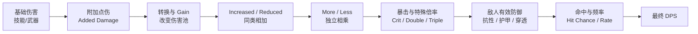
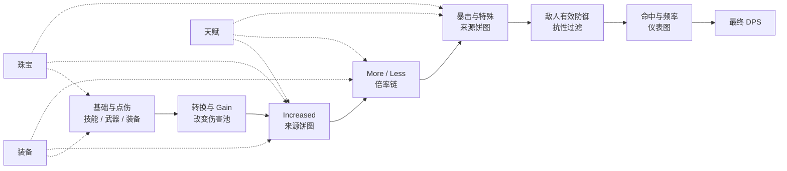

# 伤害结构报告组件详细设计

> 状态：设计中
> 目标：用用户熟悉的“七大伤害区域”解释当前构筑的伤害组成、计算关系和来源构成。
> 组件：`DamageStructureReport`

## 1. 设计目标

用户打开这个组件后，应该在很短时间内回答四个问题：

1. 我的伤害是经过哪些区域形成的？
2. 每个区域当前的数值是多少？
3. 每个区域主要来自装备、天赋、珠宝还是技能？
4. 当前构筑最明显的结构短板在哪里？

这是一个“构筑伤害结构报告”，不是装备购买建议，也不是第二张词缀收益表。它展示当前构筑已经形成的结果和组成，让用户理解自己的伤害链。

## 2. 用户心智与技术事实

玩家通常把伤害理解为类似下面的链条：

```text
点伤 x 增伤 x 总增 x 暴击 x 攻速
```

PoB2 的真实计算比这个说法更复杂：

- 基础伤害和附加点伤先形成伤害池；
- 转换和 `Gain as Extra` 会创建或转移伤害分支，不是一个简单的百分比乘数；
- `Increased/Reduced` 同类相加；
- `More/Less` 独立相乘；
- 暴击、双倍/三倍伤害、命中率、频率和敌人防御在不同阶段参与计算；
- DoT、触发、Impale、Mirage 等属于不同的结果分支。

因此，界面采用“用户心智的七个区域”作为叙事结构，但每个区域都标注 PoB2 的真实含义。不能把七个区域伪装成七个同单位、同层级、可以相加为 100% 的乘区。

## 3. 组件边界

组件使用一个独立文件：

```text
src/components/DamageStructureReport.tsx
```

首版不拆多个文件。组件文件内部可以使用私有的渲染函数或局部子组件，但必须遵守以下边界：

- 组件只负责展示，不直接读取构筑状态；
- 组件不直接调用 Lua、Worker、市场接口或装备仓库；
- 组件通过 `props` 接收已经整理好的结构化数据；
- 计算和来源归类由 PoB2 计算桥接层负责；
- 翻译文案和视觉样式可以在组件内维护，但不能把计算规则写进 JSX；
- 组件可以嵌入现有的分析页面、技能详情或独立页面，不依赖宿主页面布局。

### 3.1 非目标

本组件首版不做以下事情：

- 不显示“移除某件装备后损失多少 DPS”；
- 不计算装备购买推荐或交易价格；
- 不把所有来源强行折算成最终 DPS 百分比；
- 不使用没有定义依据的目标线、满分或综合评分；
- 不替代现有的攻击/防御收益分析表；
- 不修改 `public/pob-lua` 上游 Lua 文件。

## 4. 页面整体结构

组件从上到下分为四个视觉区：

```text
┌──────────────────────────────────────────────────────────────┐
│ 伤害结构报告   技能/Full DPS 范围        最终 DPS             │
│ 当前计算条件、纳入技能数量、数据更新时间                    │
├──────────────────────────────────────────────────────────────┤
│ 基础点伤 → 转换/Gain → Increased → More → 暴击 → 防御 → DPS │
│       可点击、可悬停、显示简化公式和实际计算含义             │
├──────────────────────────────────────────────────────────────┤
│ 七个伤害区域卡片                                               │
│ [基础点伤] [转换/Gain] [Increased] [More]                    │
│ [暴击/特殊] [命中/频率] [敌方防御]                            │
├──────────────────────────────────────────────────────────────┤
│ 来源构成与结论                                                 │
│ 装备 / 天赋 / 珠宝 / 技能 / Buff / 配置 的分层明细            │
└──────────────────────────────────────────────────────────────┘
```

### 4.1 首屏原则

- 首屏必须同时看到公式链、最终 DPS 和七个区域的摘要数值；
- 不使用进入页面后才需要点击的 Tab 作为主要导航；
- 区域卡片默认显示摘要，详细来源在卡片内部展开；
- 复杂公式使用图形和短文案，完整 PoB breakdown 放在“查看计算明细”中；
- 不在顶部堆叠大段解释文字，说明通过公式节点的 tooltip 和区域卡片副标题呈现。

## 5. 顶部摘要区

### 5.1 标题和上下文

标题建议为：

```text
伤害结构报告
```

标题下显示当前计算上下文：

- 当前技能名称或 `Full DPS`；
- 攻击技能/法术技能数量；
- 是否包含触发技能；
- 当前武器组；
- 敌人等级、抗性和距离等重要 Config；
- “基于当前 PoB2 计算结果”的数据说明。

如果是 Full DPS，必须明确显示“多个技能合计”，不能让用户误以为只分析了当前选中技能。

### 5.2 最终结果卡

右上角显示最终结果：

```text
最终总和 DPS
128,450
```

如果存在 DoT、Impale 或其他完整 DPS 分支，使用小标签说明：

```text
击中 DPS 92,300 · DoT 31,200 · 其他 4,950
```

这里的分支是结果构成，不把它们混入七个伤害区域的倍率比较。

## 6. 公式流程图

这是组件最重要的图形化元素。用户不需要先阅读文档，就能通过图看到伤害如何形成。

### 6.1 用户视角的简化流程



这张图是用户心智图，不声称 Lua 的执行代码只有这九个变量。每个节点都必须提供两个层次的说明：

```text
用户说明：这一段会把伤害放大或缩小
PoB2 含义：对应哪些字段、是否是加算、乘算或分支处理
```

### 6.2 公式展示

流程图下方使用一个可换行的公式条：

```text
最终 DPS
= 有效单次伤害 × 命中率 × 有效频率 × 技能 DPS 倍率
```

点击“展开公式”后显示更完整版本：

```text
伤害池
= 基础伤害 + 附加点伤
  → 应用转换
  → 加入 Gain as Extra 分支

类型伤害
= 伤害池
  × Increased/Reduced 因子
  × More/Less 因子
  × 类型专属因子

有效单次伤害
= 普通命中部分 × 非暴击比例
  + 暴击命中部分 × 暴击比例
  × 敌人有效防御因子

最终 DPS
= 有效单次伤害
  × 命中率
  × 攻击/施法/触发频率
  × 技能 DPS 倍率
```

### 6.3 公式图交互

- 鼠标悬停节点：高亮当前节点、前后相邻节点和对应卡片；
- 鼠标悬停箭头：显示该箭头表达的是“相加、相乘、分支还是过滤”；
- 点击节点：滚动到对应区域卡片并展开；
- 键盘焦点也必须能够触发 tooltip，不能只依赖鼠标；
- 小窗口下，流程图改成纵向步骤流，不允许横向溢出。

## 7. 七个伤害区域

七个区域是用户可理解的展示分组。每张卡片使用统一结构：

```text
区域名称
一句话解释
当前核心数值
来源构成图
短板提示
查看明细
```

### 7.1 区域一：基础与点伤

用户名称：`基础与点伤`

技术含义：技能、武器和其他来源形成的基础伤害与附加伤害池。

核心展示：

- 物理、火焰、冰霜、闪电、混沌的伤害区间；
- 每种伤害类型的平均值；
- 基础技能伤害、武器伤害、附加点伤的来源；
- 基础倍率和局部武器点伤需要单独标注。

图形：使用按伤害类型分色的水平池图，而不是饼图：

```text
物理     ████████████  2,400
火焰     ███████       1,350
冰霜     ███             520
闪电     █████           980
混沌     ██              300
```

来源构成使用同一类型内的堆叠条：

```text
火焰  [技能 45%][武器 35%][装备 10%][珠宝 10%]
```

### 7.2 区域二：转换与 Gain

用户名称：`转换与额外获得`

技术含义：伤害类型转换、`Gain as Extra` 和随机元素分支。

核心展示：

- 来源伤害类型；
- 目标伤害类型；
- 转换比例；
- Gain 分支比例和估算加入的伤害池。

图形：使用流向图，线条宽度表示转换或 Gain 的相对数量：

```text
物理 ───────────────► 火焰
  │                     ▲
  └──── Gain as Extra ──┘

闪电 ───────────────► 冰霜
```

转换和 Gain 不显示“占最终 DPS 的百分比”，只显示它们在伤害池中的流向和比例，避免错误地把分支当成最终乘数。

### 7.3 区域三：Increased / Reduced

用户名称：`同类提高`

技术含义：同一适用范围内的 `Increased/Reduced` 先相加，再形成一个因子。

核心展示：

```text
元素伤害提高：+286%
对应因子：×3.86
```

图形：使用倍率条和来源堆叠条：

```text
×3.86
基准 1.00 ├──── 装备 +80 ────┼ 天赋 +156 ┼ 珠宝 +50 ─┤
```

来源数值显示原始提高值，不声称某个来源单独贡献最终 DPS 的固定百分比。

### 7.4 区域四：More / Less

用户名称：`独立增幅`

技术含义：各个 `More/Less` 修正独立相乘。

核心展示：

```text
独立倍率：×1.74
```

图形：使用串联乘数节点：

```text
×1.20  装备
   ×
×1.25  辅助技能
   ×
×1.16  天赋
   = ×1.74
```

每个节点显示条件，例如“对稀有或传奇敌人”“满怒气”“技能处于触发状态”。条件不满足时显示为未生效，不从图中伪造有效倍率。

### 7.5 区域五：暴击与特殊倍率

用户名称：`暴击与特殊命中`

技术含义：暴击率、暴击伤害、双倍/三倍伤害、特殊技能倍率和重复命中效果。

核心展示：

```text
暴击率：68%
暴击倍率：×2.35
暴击期望因子：×1.92
```

图形：使用“普通命中/暴击命中”双分支合流图：

```text
普通命中 × 32% ─┐
                 ├─► 暴击期望伤害 ×1.92
暴击命中 × 68% ─┘
```

双倍、三倍和特殊技能倍率作为附加节点显示，不与暴击率混成一个百分比。

### 7.6 区域六：命中与频率

用户名称：`命中与输出频率`

技术含义：命中率、攻击速度、施法速度、触发频率、冷却、重复次数和有效命中频率。

核心展示分成两个并列指标：

```text
命中率              94%
有效输出频率        2.80 次/秒
```

图形：使用两个仪表条或横向指标条，不合成一个“速度倍率”：

```text
命中率       ██████████████████░░ 94%
输出频率     ███████████░░░░░░░░░ 2.80 / 秒
```

触发技能必须标注频率来源，例如“格挡触发”“暴击触发”“技能冷却”，避免用户误以为触发技能直接继承父技能攻速。

### 7.7 区域七：敌人有效防御

用户名称：`敌人防御与有效伤害`

技术含义：敌人抗性、护甲、穿透、降抗、敌人承受伤害和物理减伤。

核心展示：

```text
火焰抗性       75%
火焰穿透       18%
有效抗性       57%
有效伤害因子   ×0.43
```

图形：使用防御过滤流程：

```text
敌人抗性 75% → 穿透 18% → 有效抗性 57% → 伤害 ×0.43
```

物理伤害显示护甲和实际伤害相关的减伤结果，不把护甲简单翻译成一个固定抗性百分比。Config 变化时，区域卡片必须显示“基于当前敌人配置”。

## 8. 来源构成规则

### 8.1 来源分类

统一分为以下来源组：

| 来源组 | 包含内容 |
| --- | --- |
| 装备 | 武器、防具、饰品、符文、灵魂核心、装备附加效果 |
| 天赋 | 天赋树节点、关键天赋、天赋珠宝影响的节点效果 |
| 珠宝 | 装备中的珠宝、天赋树珠宝、珠宝范围内节点效果 |
| 技能 | 主技能、辅助技能、技能等级和技能内置效果 |
| Buff | 光环、战吼、药剂、球、战斗状态和持续 Buff |
| 配置 | 用户 Config、敌人状态和计算模式 |

“珠宝范围内的天赋效果”来源归类为珠宝影响，但具体节点仍可在明细中显示，避免用户误解为珠宝本身提供了全部词缀。

### 8.2 数值表达规则

不同区域使用不同的数值表达：

- 基础与点伤：伤害区间、平均伤害；
- 转换与 Gain：流向比例和目标池增量；
- Increased：原始相加值和最终提高因子；
- More：各独立倍率和乘积；
- 暴击：暴击率、暴击倍率、期望因子；
- 命中与频率：百分比和每秒次数；
- 敌方防御：有效抗性、减伤和有效伤害因子。

来源百分比只在同一个区域、同一种数值单位内使用。例如装备贡献 `+80% Increased` 可以和天赋 `+156% Increased` 做同池堆叠，但不能说装备贡献了最终 DPS 的 35%。

### 8.3 不显示移除损失

组件不显示以下内容：

```text
移除装备后 DPS -12%
移除珠宝后 DPS -8%
```

来源构成只解释“当前公式中有哪些来源、各自提供多少输入值”。用户需要决策时，继续使用现有的属性收益分析页面，而不是在本报告中混入移除模拟结果。

## 9. 长短板表达

### 9.1 不使用虚构目标

组件不提供“理想值”“满分”“目标线”或强行归一化的雷达图。因为不同 BD、技能和敌人配置没有统一的合理目标。

### 9.2 使用结构性提示

每个区域只做当前构筑内部的结构提示：

- `伤害池主要集中在火焰`；
- `More 来源较少`；
- `暴击命中贡献较高`；
- `敌人抗性使该伤害类型受到明显削减`；
- `触发频率是当前输出链的主要限制`。

提示必须由实际计算字段生成，不使用固定的全局评分。

### 9.3 顶部短板摘要

顶部可以显示最多三条“当前结构提示”，但文案必须是描述性而不是购买建议：

```text
当前结构提示
1. 闪电伤害池较小，当前主要伤害来自火焰。
2. More 独立倍率来源较少。
3. 敌人冰霜抗性对冰霜分支削减明显。
```

如果没有足够证据生成提示，则隐藏该区域，不显示“无”或空卡片。

## 10. 交互设计

### 10.1 卡片展开

- 默认七张卡片只显示摘要；
- 点击卡片展开来源构成和 PoB2 breakdown；
- 同时只允许一个卡片展示完整明细，减少页面纵向跳动；
- 展开后保留公式节点高亮状态；
- 返回顶部按钮只在页面滚动后出现。

### 10.2 来源联动

- 点击“装备”来源，高亮该区域中所有装备来源；
- 点击“天赋”来源，高亮天赋来源；
- 点击“珠宝”来源，高亮珠宝来源；
- 来源没有数值时不显示空的图例项；
- 来源名称使用项目现有翻译能力，不显示原始 `Item:`、`Tree:`、`Skill:` 前缀。

### 10.3 公式明细

“查看计算明细”打开当前区域的结构化明细：

- 基础值；
- 加算池；
- 独立乘数；
- 条件；
- 最终区域结果。

原始 PoB breakdown 只作为明细内容来源，组件不通过正则重新解析最终文本来计算数值。

## 11. 数据契约建议

组件输入使用结构化数据，建议形状如下：

```ts
interface DamageStructureReportData {
  skillName: string
  calculationScope: 'selectedSkill' | 'fullDps'
  includedSkillCount: number
  totalDps?: number
  hitDps?: number
  dotDps?: number
  context: {
    weaponSet?: string
    enemyLevel?: number
    enemyDistance?: number
    configLabel?: string
  }
  formulaSteps: FormulaStep[]
  layers: DamageLayer[]
  structureHints: StructureHint[]
}

interface FormulaStep {
  id: string
  label: string
  shortExplanation: string
  technicalExplanation: string
  relation: 'add' | 'multiply' | 'branch' | 'filter'
  layerId: string
}

interface DamageLayer {
  id: string
  label: string
  kind: 'pool' | 'flow' | 'additive' | 'multiplicative' | 'expectation' | 'rate' | 'mitigation'
  summaryValue: string
  summaryUnit?: string
  factor?: number
  sourceGroups: DamageSourceGroup[]
  details: DamageLayerDetail[]
}

interface DamageSourceGroup {
  type: 'equipment' | 'tree' | 'jewel' | 'skill' | 'buff' | 'config'
  label: string
  value: number
  unit: string
  colorToken: string
}

interface StructureHint {
  layerId: string
  severity: 'info' | 'notice'
  text: string
}
```

组件不得依赖 `SkillCalculationDetails` 的内部字段布局。PoB2 桥接层可以把现有的技能详情、伤害类型、来源和 breakdown 转换为上述报告数据。

## 12. 计算与数据来源

### 12.1 PoB2 计算权威

报告中的数值全部来自同一次 PoB2 计算：

- 基础伤害、转换和 Gain 使用 PoB2 计算后的伤害池；
- Increased 和 More 使用 ModDB 聚合结果；
- 暴击、命中、频率和敌方防御使用同一 Config；
- Full DPS 使用现有的完整 DPS 技能范围；
- 触发技能使用实际触发频率，不把父技能名称当作子技能伤害。

### 12.2 缓存

组件本身不负责缓存。计算桥接层使用现有构筑计算缓存，缓存键必须包含：

- 构筑内容；
- 当前技能或 Full DPS 范围；
- 武器组；
- 敌人 Config；
- 计算模式；
- PoB Lua bundle 版本和哈希。

### 12.3 空状态和异常

- 没有有效 DPS 时显示“当前没有可分析的伤害来源”；
- 某个区域没有数据时隐藏该区域，不显示虚假的 0；
- 某一技能不适用暴击时，暴击区域显示“不适用”；
- 没有敌人 Config 时，敌方防御区域显示“未应用敌人防御”；
- 计算失败时显示错误状态和重试入口，不渲染部分旧结果。

## 13. 视觉规范

- 延续现有分析页面的黑金/流金视觉，但图形使用不同颜色区分伤害类型和来源；
- 基础伤害使用元素色，More 使用金色，防御过滤使用灰红色，最终 DPS 使用高亮金色；
- 不使用纯红绿判断“好坏”，避免把没有目标值的结构误解成评分；
- 来源条使用固定颜色映射，装备、天赋、珠宝在所有卡片中保持一致；
- 图形必须有文字数值，不能只依赖颜色和长度；
- 卡片宽度稳定，长来源名称换行，不能造成布局跳动；
- 小窗口下卡片单列，公式图垂直排列；
- 动画只用于流程高亮和来源联动，不使用持续闪烁干扰阅读。

## 14. 验收标准

### 用户理解

- 用户首次进入页面，可以通过流程图理解伤害是如何从点伤走到最终 DPS；
- 用户能看到七个用户心智区域，但不会被误导为七个相同的乘法变量；
- 用户能看到装备、天赋、珠宝、技能等来源构成；
- 用户能区分“公式输入值”和“最终 DPS”；
- 页面不显示移除装备后的损失值。

### 数据正确性

- 数值与同一 PoB2 Config 下的计算结果一致；
- Increased 显示相加池，More 显示独立乘积；
- Conversion/Gain 使用流向表达，不伪造为单一乘数；
- 暴击、命中、频率和敌方防御显示各自真实结果；
- DoT 和触发分支不被错误塞入普通击中公式；
- 来源分类不改变 PoB2 的计算结果。

### 工程边界

- 组件可以在没有收益分析页面的情况下独立渲染；
- 组件不直接依赖构筑全局状态；
- 组件不修改上游 PoB Lua；
- 数据契约有明确的空值和不适用状态；
- 组件样式和现有分析页面隔离，修改该组件不会影响装备差异、查价和技能组界面。

## 15. 后续扩展

首版只实现当前构筑的静态结构报告。后续可以在不改变组件边界的情况下增加：

- 多技能之间的伤害结构对比；
- Full DPS 中各技能分支的结构占比；
- DoT、Impale、触发技能的独立结果卡；
- 来源点击后定位到装备、天赋或珠宝详情；
- 与现有属性收益分析页面的跳转，但不把两个页面的数据合并成一个评分。

## 16. 总览线框与最终图形布局

### 16.1 首屏总览

七个伤害区域在桌面端平铺为同一视觉层级。顶部先给出公式流程和最终 DPS，下面的区域卡片再解释每一段的数值与来源。

```text
┌──────────────────────────────────────────────────────────────────────────────────────────────┐
│                                      伤害结构报告                                             │
│  当前技能：霹雳闪 · Full DPS：4 个技能 · 武器组：主手                         最终 DPS：128,450 │
├──────────────────────────────────────────────────────────────────────────────────────────────┤
│                                                                                              │
│  基础/点伤       转换/Gain       Increased       More        暴击/特殊      敌人防御    命中/频率 │
│      │              │              │             │              │             │           │      │
│      ▼              ▼              ▼             ▼              ▼             ▼           ▼      │
│  [2,400]       [物理 → 火焰]    [+286%]       [×1.74]        [×1.92]       [×0.43]   [94% / 2.8/s]│
│                                                                                              │
├──────────────────────────────────────────────────────────────────────────────────────────────┤
│                                      七大伤害区域                                             │
│                                                                                              │
│ 基础与点伤 │ 转换与 Gain │ 同类提高 │ 独立增幅 │ 暴击与特殊 │ 敌人有效防御 │ 命中与频率       │
│   ◉ 饼图   │   流向图    │  ◉ 饼图  │ 倍率链图 │   ◉ 饼图   │   过滤流程图 │   仪表图         │
│ 装备 35%   │ 物理→火焰  │ 装备 28% │ ×1.20装备│ 装备 20%   │ 抗性→穿透   │ 命中率 94%      │
│ 天赋 48%   │ Gain +35%  │ 天赋 55% │ ×1.25技能│ 天赋 50%   │ →有效×0.43  │ 频率 2.8/秒     │
│ 珠宝 17%   │            │ 珠宝 17% │ ×1.16天赋│ 珠宝 30%   │             │ 冷却限制       │
│                                                                                              │
├──────────────────────────────────────────────────────────────────────────────────────────────┤
│ 来源图例：装备  ●    天赋  ●    珠宝  ●    技能  ●    Buff/配置  ●                            │
├──────────────────────────────────────────────────────────────────────────────────────────────┤
│ 当前结构提示：主要伤害来自火焰 · Increased 主要来自天赋 · 输出频率受到冷却限制              │
└──────────────────────────────────────────────────────────────────────────────────────────────┘
```

### 16.2 公式总图

公式总图使用用户熟悉的顺序讲解伤害形成过程。节点下方显示当前区域的核心数值，点击节点可以定位到对应卡片。



### 16.3 图形选型规则

| 数据表达 | 图形 | 用户看到的内容 |
| --- | --- | --- |
| 同一区域内的来源构成 | 饼图/环形图 | 装备、天赋、珠宝、技能等来源比例 |
| 伤害类型构成 | 饼图/环形图 | 物理、火焰、冰霜、闪电、混沌的当前占比 |
| 转换与 Gain | 流向图 | 伤害从哪种类型流向哪种类型 |
| Increased/Reduced | 来源堆叠条 + 倍率摘要 | 同类值如何相加、最终形成什么因子 |
| More/Less | 串联倍率链 | 每个独立倍率及乘积 |
| 暴击与特殊命中 | 双分支合流图 | 普通命中和暴击如何形成期望伤害 |
| 敌人防御 | 过滤流程图 | 抗性、穿透和有效伤害因子 |
| 命中与频率 | 仪表图/指标条 | 命中率、攻击/施法/触发频率和冷却限制 |

饼图只表达同一区域内、同一种单位的来源构成。不得用饼图表达七个区域之间的比例，也不得把 More、频率或敌人防御伪装成可以加总为 100% 的来源份额。
